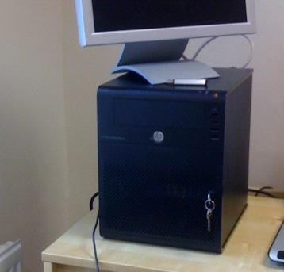

.. role(emphasis):: file

========================================
Install and Admin of development servers
========================================

My 'Setup' includes a HP ProLiant MicroServer - basically a simple
server in a nice cube chassis.  I am using this as the host server for
all virtualised Ubuntu servers.  This is how I set it up and keep it
running.

 

OS Install
==========

Download the Ubunutu *server* version.  This has no X Windows, and
more especially plays well with the expectations of a server
environment (OpenSSH-server installed by default, things respect
changes to resolv.conf etc.)

You can get the 11.10 version `here
<http://www.ubuntu.com/start-download?distro=server&bits=32&release=latest>`_
but be aware that a new version (12.04) is in final Beta,  and that new version will be a `LTS
<https://wiki.ubuntu.com/LTS>`_ version.  It is good practise to run
on the LTS version as Canonical expect to support that for 5 years
with upgrades.

However 11.10 is sufficient for now, plus the migration will be a good test.

* Terminology

  Host and VMHost
   Host is the host OS that is closest to the bare metal. VMHost is a clearer alias.

  VHost
   Virtual Host is the virtual machine running on top of the VMHost

  Server
   A program, running on VMHost or VHost that performs a specific, usually network related function.
   It is considered a third-party program, supported by someone not us.  Think Apache, Nginx.

  Application
   A program or set of programs that are written / supported by us.  

  Build
   building an OS, VHosts, Servers ready for the Application to be deployed

  Deploy
   applying the code from our Application to the approcpriate VHosts.

  Configure 
   part of both Build and Deploy
   

* Policy on backports, out of date applications etc.

  Ubuntu, like Debian, and quite reasonably, limit the support for
  third party applications (e.g. Nginx) to versions they have tested
  on that release.

  To find out which is supported see http://packages.ubuntu.com/.  For
  example apt is 0.8.16 in Oneric and 0.8.13 in natty.  So if we
  wanted the oneric version of apt, but wanted not to upgrade the
  machine, we theoretically would be unsupported.

  As such we can take a simple policy - we 'trust' Canonical, and 
  just update all our security updates from them each time.
  We also *pin* the application dependancies (that we know of)
  so we can get the latest app version from a release that is up ahead.

.. note:: what is the current policy - get Ross' comments

Download and install Ubuntu
---------------------------

Download as specified above.  COnvert the ISO to .img file and put onto a USB disk and install
Get a clean install

:todo: Kickstart / preseed file

partition layout:
   / 30GB
   /swap 10GB (2*RAM Max + a bit)
   /home 30GB
   /var  (remainder)

Keeping up to date
------------------

Patch day?
:todo: Automated review of each machine to see where we are aligned and not.

3. install base pkgs
~~~~~~~~~~~~~~~~~~~~
::
    sudo apt-get install lxc debootstrap bridge-utils
    sudo apt-get install emacs
    # because you know you have to have emacs because editing with pico is a joke...

4. setting up networking statically
~~~~~~~~~~~~~~~~~~~~~~~~~~~~~~~~~~~

..   seems the linux curse strikes - debian has /etc/networking/interfaces, but u=buntu has /etc/network/interfaces

Usually we would set up ethernet by adjusting the :file:`/etc/network/interfaces`

::

     # The loopback network interface
     auto lo
     iface lo inet loopback

     # The primary network interface
     auto eth0
     iface eth0 inet static
         address 10.0.0.10
         gateway 10.0.0.1
         network 10.0.0.0
         netmask 255.255.255.0

     
However, we now want to introduce a bridged network - think of this is
a wrapper around the eth0 network card.  The bridge will be able to
add and remove ethernet packets off eth0 in software.  To any virtual
machine on the VMHost it will seem as if the bridge is their own NIC,
to eth0 it will seem as if they are on a unusually busy ring.

bridge network:

::

    # The loopback network interface
    auto lo
    iface lo inet loopback

    # The primary network interface
    auto eth0
    iface eth0 inet manual

    auto br0
    iface br0 inet static
	address 10.0.0.103
	network 10.0.0.0
	netmask 255.255.255.0
	gateway 10.0.0.1
	bridge_ports eth0
	bridge_stp off
	bridge_fd 0
	bridge_maxwait 0

    now restart networking ::

      sudo /etc/init.d/networking restart

    We should then have a successful bridged adaptor - br0 is wrapping eth0 as it were.

6. control groups

   it seems that this script, run on boot,will mount cgroups sensibly
   This is part of teh lxc install above.

::

    init/cgroup-lite.conf

    pbrian@hpcube:/etc$ mount
    /dev/sda1 on / type ext4 (rw,errors=remount-ro)
    proc on /proc type proc (rw,noexec,nosuid,nodev)
    sysfs on /sys type sysfs (rw,noexec,nosuid,nodev)
    fusectl on /sys/fs/fuse/connections type fusectl (rw)
    none on /sys/kernel/debug type debugfs (rw)
    none on /sys/kernel/security type securityfs (rw)
    udev on /dev type devtmpfs (rw,mode=0755)
    devpts on /dev/pts type devpts (rw,noexec,nosuid,gid=5,mode=0620)
    tmpfs on /run type tmpfs (rw,noexec,nosuid,size=10%,mode=0755)
    none on /run/lock type tmpfs (rw,noexec,nosuid,nodev,size=5242880)
    none on /run/shm type tmpfs (rw,nosuid,nodev)
    cgroup on /sys/fs/cgroup type tmpfs (rw,relatime,mode=755)
    cgroup on /sys/fs/cgroup/cpuset type cgroup (rw,relatime,cpuset)
    cgroup on /sys/fs/cgroup/cpu type cgroup (rw,relatime,cpu)
    cgroup on /sys/fs/cgroup/cpuacct type cgroup (rw,relatime,cpuacct)
    cgroup on /sys/fs/cgroup/memory type cgroup (rw,relatime,memory)
    cgroup on /sys/fs/cgroup/devices type cgroup (rw,relatime,devices)
    cgroup on /sys/fs/cgroup/freezer type cgroup (rw,relatime,freezer)
    cgroup on /sys/fs/cgroup/net_cls type cgroup (rw,relatime,net_cls)
    cgroup on /sys/fs/cgroup/blkio type cgroup (rw,relatime,blkio)
    cgroup on /sys/fs/cgroup/perf_event type cgroup (rw,relatime,perf_event)

7. create a container
~~~~~~~~~~~~~~~~~~~~~

What is a container?  *L*inu*X* *C*ontainers are the Linux version of
the lightweight jails coming from the Solaris Zones and FreeBSD Jails 
heritage.

Essentially, it is a form of virtualisation.  Execpt that instead of
being able to run any kernel, you run on the kernel of the VMHost.

BSD Jails and SOlaris Zones are well known and trusted services.  LXC
is in the mainline kernel and is in production but is not as
widespread.

I recommend reading the man pages - they are much more up to date than 
most anything on the interwebs.

::

 
    man lxc-create 
    man lxc

What will lxc do?
~~~~~~~~~~~~~~~~~

lxc will create in :file:`/var/lib/lxc/{name}/` a :file:`rootfs` as well as `config`
Into :file:`rootfs` it will copy the entire userland of the VMHost, and apply *chroot on steroids*.
You can alter the sshd_config file in :file:`/var/lib/lxc/cnx01/rootfs/etc/ssh/sshd_config` and it will
run those changes in the container only.

Its really is a virtualised machine.

Disadvantages
~~~~~~~~~~~~~

LXC is a little immature compared to, say, FreeBSD Jails.  It may of
course be my lack of knowledge but the default of copying the whole
userland over means that upgrading is essentially not an upgrade but a
reinstall (upgrade the underlyinh VMHost, and the other packages will
fail.  nullfs is used effectively in BSD Jails to overcome this
problem (essentially each Jail can be symlinked down to use the VMHost
binaries - so one upgrade rules them all.

Its also less mature, less well understood, less widely used so
production use is not a no-brainer.  However for turning one box into
20 dev servers it is a winner.

we need 

1. a lxc configuration file

::

   pbrian@hpcube:/etc/lxc$ cat /etc/lxc/lxc.conf
   lxc.network.type=veth
   lxc.network.link=br0
   lxc.network.flags=up

2. Create the container

I recommend reading the lxc-create script
::

    sudo lxc-create -t ubuntu -f /etc/lxc/lxc.conf -n cnx01

    <this will essentially copy the entire userland over.>

    ...

    Setting up lxcguest (0.7.5-0ubuntu8) ...
    'ubuntu' template installed
    'cnx01' created

3. setup networking on container
~~~~~~~~~~~~~~~~~~~~~~~~~~~~~~~~

It defaults to DHCP (see the lxc-create script)

:file:`/var/lib/lxc/cnx01/rootfs`  is where the rootfs lives.

::

    pbrian@hpcube:/etc/lxc$ ls -l  /var/lib/lxc/cnx01/rootfs/etc/network/interfaces 
    -rw-r--r-- 1 root root 63 2012-04-17 19:56 /var/lib/lxc/cnx01/rootfs/etc/network/interfaces

We now need to alter :file:`/var/lib/lxc/cnx01/rootfs/etc/network/interfaces` to hold a static 
address for eth0::

    pbrian@hpcube:~$ cat /var/lib/lxc/cnx01/rootfs/etc/network/interfaces
    auto lo
    iface lo inet loopback

    auto eth0
    iface eth0 inet static
	address 10.0.0.104
	network 10.0.0.0
	netmask 255.255.255.0
	gateway 10.0.0.1

and check resolv.conf

4. start the container instance 
::

    sudo lxc-start -n cnx01 -d

-d pushes it to daemonise.  So we can run many startups from say rc.local.

We can connect to the console using virtual tty ::

    sudo lxc-console --name cnx01

    ...

    login: xxx

and we can exit that the same way we do for screen (which is what is used in background I think)
-> ctl-a q for quitting

* But what is the password?
  in the lxc-create script look a chpasswd command - this is used to give the root user 
  the password root (root:root) - so the box is not very secure on first boot.  Another 
  thing to fix, but it does mean you can ssh in and passwd / adduser to your hearts content

5. config and advanced useage
~~~~~~~~~~~~~~~~~~~~~~~~~~~~~

There is a lot we could do on top of the basics.  But for now this is sufficient.

config is stored here - and the docs reflect the commands seen::

    less /var/lib/lxc/cnx01/config

Refer to the examples in /usr/lib/lxc/templates

biblio
~~~~~~

http://lxc.teegra.net/#_setup_of_the_controlling_host
https://help.ubuntu.com/community/KVM/Networking
http://wiki.debian.org/NetworkConfiguration#The_resolv.conf_configuration_file
http://www.linuxfoundation.org/collaborate/workgroups/networking/bridge#Bridging_and_Firewalling
 

