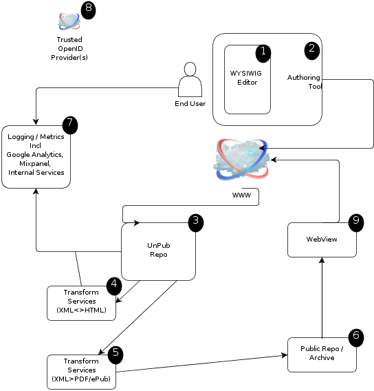
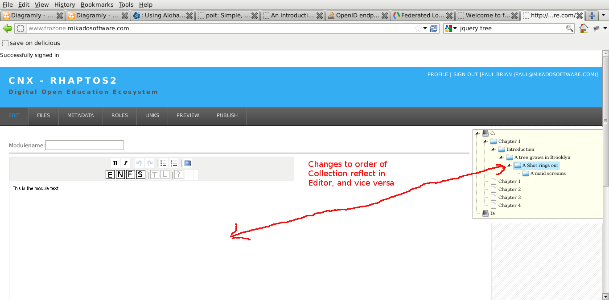

=======================
Index for Specification
=======================

Preamble
========

These documents are an attempt to pull together my understanding of
the project, in the possibly vain hope that it will both improve my
work, and help spread discussion and understanding with the rest of
the team.

While this is mostly written in a defintive style, that is just habit
of many years, rather than the presumption of authority on the
project.  Added to which not all (if any) of the statements are
nessecarily correct, technically or policy wise.

In short, this is my personal specification, presented to be useful.

If it sounds like I am telling you what to do, or have made decisions
without consulting anyone, I am not presuming to do so, but had to say
something defintively somewhere, otherwise the whole thing would be
useless as a spec anyhow.

With that in mind, ...

Introduction
============

We are trying to re-write a pretty major piece of software, that has
over the years become slowly ossified and strongly coupled.  This is
despite the efforts of talented programmers over the approximate
decade of the software's lifetime.

As Phileas Fogg might have said, "Don't complain Sir that your boat
has no deck nor furnishings, for we have at least arrived, and arrived
in time."

So, this spec is primarily a (unpublished) editor and repository,
ideally aimed at being federated across multiple university sites,
with an architecture favouring document based storage, REST based
communication protocols and small, discreet apps performing stateless
actions.

Overview
========

See the :doc:`simple-spec` for a first cut at this, especially the
notes on the below dioagram, and the list of components.

            Overview

Resources
=========

collections
-----------

A :doc:`collection-doc` is essentially a tree of links, refering to
one or more :doc:`section-doc`s in a fixed (user specified) order.

It will contain ACLs to ensure the collection is kept (realtively)
private, and it will use internal :doc:`userIDs </spec/user-detail>`
to point the ACLs at the correct locations.

REST 
~~~~

1. POST
   accepts only a properly formatted :doc:`collection-doc` as JSON 
   where that d
   401 failure otherwise.

   Will later on support new resources like collection/contents
   so POST ing only that part.  Might not be desirable.

2. PUT 

   accepts only a properly formatted :doc:`collection-doc` as JSON 
   401 failure otherwise.

3. DELETE

4. GET

Use cases
~~~~~~~~~

TBC

GUI
~~~

The expected form for collection manipulation will initally be a
simple tree widget in JQuery.

It will also be possible for the sections to be reordered through the
editor (Phil to provde details IIRR the difficulties inherent mean we
shall allow only section by section re-ordering.  Phil?)

I expect that such reordering internal to the editor will need a means
of passing the order of sections back in and out of the editor and the
author-tools-client

The ultimate goal of this is to send a ordered, nested, list of section IDs
to the server.  Clearly this means that any new section must first be POST'd 
and then the UUID can be added to the collection.

Notes 

We shall disallow nesting of collections at the moment.	   

Implementation
~~~~~~~~~~~~~~

.. py:class:: rhaptos2.repo.collection
 
Collection class will load a JSON document and store it internally It
will be able to create a collection from python inputs, seperately and
then output JSON

.. py:function:: collection.load_JSON

.. py:function:: collection.dump_JSON

.. py:function:: collection.set_id

Most other data manipulations should be done through direct twiddling.  I think.

   

Sections
--------

A :doc:`section-doc` is a fragment of valid HTML5, that when
concatenated with other sections in the correct order specified by one
(or more) collections, will produce a valid HTML5 document, and that
document will represent to document written.

A section derives its security status from ACLS of a collection.  An
approval process will either store acls with each section (easy to
implement p[ossibly less secure and verbose) or will look up a
collection, and from that collection approval a user to view or alter
the section.

TBC: what if two collections reference the same section, and they try to apply different,
conflicting ACLs.?  

REST 
~~~~

1. POST

2. PUT

3. DELETE

4. GET

Implementation
~~~~~~~~~~~~~~

.. py:class:: rhaptos2.repo.section
 
section class will load a JSON document and store it internally It
will be able to create a section from python inputs, seperately and
then output JSON

.. py:function:: section.load_JSON

.. py:function:: section.dump_JSON

.. py:function:: section.set_id

Most other data manipulations should be done through direct twiddling.  I think.

Users
-----

We want to be able to have a single userID that is unique across both
one repo "system" and across a federated system (ie several
universities holding their own unpub repos).

We shall use :doc:`UUIDs <coding-standards>` for uniqueness, and we shall prefix the UUID 
with the canonical name of the repo that first issued the UserID, to ensure both that uniqueness across a federated system is guaranteed, and that we know which repo to visit to retrieve details of the user.

The :doc:`user-detail-store`

We shall link a :doc:`user-detail` to that 

We need a reliable user identifier and means of holding data on a user, and linking that user to an OpenID

We shall create a new, distributable and federatable user id of the follwoing form:

   repo domain name reversed, with uuid in urn string format

   org.cnx.users.f81d4fae-7dec-11d0-a765-00a0c91e6bf6

   giving us a userid that is unique, linked to originating repo, so it can be 
   traced back to a given source and fairly easily details requested from it.

The full process of authnetication and login is dealt with in :doc:`feature-auth-login`.

REST 
~~~~

1. POST

   Accepts JSON doc only in proper form.

   Will accept NULL values for eveything apart from openids

   * openids:  MUST be a list of one or more URLS
   * id     :  MUST be null
   * version:  MUST NOT be null, but currently only 1.0.0 is valid

   example::

       POST /user/ HTTP/1.1
       Host: www.cnx.org
       ...

	{
	 "details": {
	     "Address": null,
	     "FullName": null,
	     "email": null
	 },
	 "id": null,
	 "openids": [
		"http://openid.cnx.org/pbrian"
		    ],
	 "version": "1.0.0"
	}   

2. PUT

   Accepts JSON doc only in proper form.
   
   Will accept NULL values for eveything apart from openids

   * openids:  MUST be a list of one or more URLS
   * id     :  MUST NOT be null
   * version:  MUST NOT be null, but currently only 1.0.0 is valid

   example::

       PUT /user/org.cnx.user.f9647df6-cc6e-4885-9b53-254aa55a3383 HTTP/1.1
       Host: www.cnx.org
       ...

	{
	 "details": {
	     "Address": null,
	     "FullName": null,
	     "email": "paul@mikadosoftware.com"
	 },
	 "id": "org.cnx.user.f9647df6-cc6e-4885-9b53-254aa55a3383",
	 "openids": ["http://openid.cnx.org/pbrian"]
	 "version": "1.0.0"
	}   

3. DELETE
   
   Will accept delete from only the user specified?
   WHat about admin functions?
   I suggest there are collections in each repo that are labelled admin and 
   used as ACLS for this admin function.  
   Not yet implemented !

   example::

      DELETE /user/org.cnx.user.f9647df6-cc6e-4885-9b53-254aa55a3383 HTTP/1.1
      Host: www.cnx.org

   

4. GET

   * /user/
   list of all users????

   * /user/org.cnx.user.f9647df6-cc6e-4885-9b53-254aa55a3383
   the JSON :doc:`user-detail` for that users

Implementation
~~~~~~~~~~~~~~

Interaction with memcache

:class:`rhaptos2.repo.model.User`

