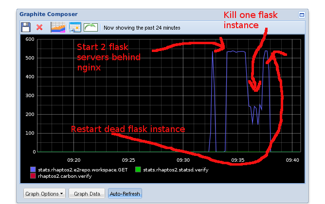

===============
Rhaptos2 - Repo 
===============

1. Metaphors for how the repo will work
2. Infrastructure and Robustness
3. Open technologies 

----

Introduction
============

Aim to supply an unpublish repository, (and more to come)

* based around REST principles,
* that is resilient, 
* straight-forward to support
* open to developers outside of CNX, 
* tested

----

Metaphors
=========

Three major metaphors possible:

1. Files and Folders

   This has been prototyped and can be seen in next slide 
   It was quickest and easiest to create and allow people to get a "feel"

2. Google-docs-style

   Is currently being worked on, is likely to be the best choice.  It
   has an "infinite" space of documents, and will not restrict one
   user navigating through the sections in a different way to the
   original owner, as a folder metaphor would.

3. Github style
   Unlikely to be implemented.

----

ScreenShot of Folder Metaphor
=============================

We base our logins on the OpenID standard.

.. figure:: reposcreen-small.png

----

Open to Developers
==================

We want to encourage participation from outside of CNX

1. Lots of documentation (frozone.readthedocs.org) - very nearly up to date!
2. Getting started and installation code heavily worked on.
3. More community work needed...

----

Open Technologies
=================

* REST
  Simple

* OSS
  Free

* OpenID 
  Ease of use for end users

----

Robust
======

Results of perfomance testing
-----------------------------

I fired 100,000 requests at the load-balanced web service.  (two web
apps behind one load balancer, the "out-of-the-box" config)

It took five minutes, and during that time I *killed* one web app, and
let the system notice and bring it back on line.

----

Results
=======

1. Proves the load balancer can dynamically adjust load

2. Demonstrates that the upstart monitoring can identify a crash and restart a process automatically

3. shows clearly that two apps serve more requests than one.

----

Support and deployment
======================

A lot of effort has gone into making the developers deployment *exactly* the same as production *as far as possible*  

We run continuous integration servers in the cloud and can deploy autopmatically on each commit.

We are on the Rackspace Early-access for the OpenStack (the OSS alternative to Amazon Web Services)

We have moniotring and logging centralised and visible (see the above performance test)

----

Tests
=====

* We automate Firefox and Chrome for "balck box" testing

(Show video? Image?)

* We have unit tests enbedded in documents

(Show Doctest)

* We have mid-level tests 

(Show flask-app testing)

----

Summary
=======

* A very exciting project
* Licensing issues - have written all routines from scratch ensuring 
  no complications
* UnPublish repo slower as majority of infrastructure work done here
* Expect QA ready end of August (!!!)
* Plenty more to do ...
