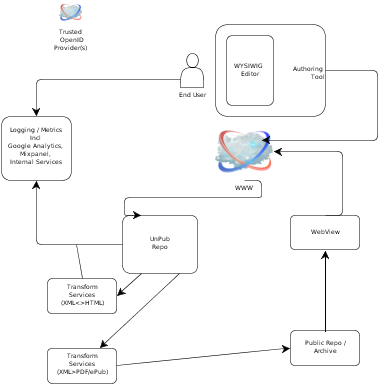

=============================================================
UnPub repository and editor - Simple functional specification
=============================================================

This is a draft spec, and intended to change over time.  It is however
expected to allow us to agree on the fundamental principles and
approaches to producing the repository.

I apologise beforehand for at least three problems - I will mix features with solutions,
I will be overly verbose, and I have forgotten the third.  As the drafts are rewritten all of these will improve.

Please see :doc:`usecases` for the expected use cases for the
repository

There are three main concepts to bear in mind

1. Google-docs like system
2. storing smallest unit of knowledge individually,
3. compiling them back together is defined by a graph, the default being 
   a tree (TOC) but any graph is possible.
4. Small components, loosely coupled, minimal overhead.

Overview
========

  
            Overview

The whole system (from creation of documents to production and serving
of formatted pdfs/ePubs etc) is show above.  We shall briefly discuss
each area and how it fits together before going into more detail on
the editor/repository.

There are a number of components in the system as a whole, which we
intend to make much more loosely coupled (ie to create them as
seperate API wrapped services.)

As such this spec will try to follow a simple pattern - the overview
will discuss briefly the components, and then focus more heavily on
the *interactions and APIs* between the components.  This will I hope
allow people to understand the flows between components before getting
into detail in the components.

Components 
----------

1. WYSIWIG/M Editor

2. Authoring Client

3. unpub-repo

4. Transform services (CNXML<->HTML)

5. Print Queue (Printing CnxML -> PDF etc)

6. pub-repo

7. logging & metrics

8. authentication / authorisation

9. Web-view

One paragraph descriptions
==========================

1. Editor
---------

A javascript based WYSIWIG (or possibly WHYSIWIM) editor of HTML5.
Currently the target version is Aloha, but may move to other editors.
I am viewing this as a 'black box' - the authoring tools will retrieve
from the server the html to be edited and insert it into the black
box, then when needing to save will extract the html and send that
back to the server.

Importantly Aloha allows real-time collaboration via websockets
(Other people's edits turn up on your view)

issues::

  conversion
  force section editing
  in / out process
  use of collection / tree
  server side support

2. Authoring Client
-------------------

A specially built Javascript-based set of authoring tools, run on the
client browser.  They allow

* import/export of content of modules to and from the editor 
* editing of meta data around modules (see metadata)
* interaction with REST-services, knowledge of the server protocols
* cleaner interaction with browser and updates, potentially using client side templating

Issues::

  clean interaction with Editor
  Reliability across REST interface
  Buffering 

3. unpub-repo
-------------

A Python based web service, adhering closely to REST principles, that
stores the currently edited module, on the server, and provides
resilience and robustness.

* Single sign on using OpenID technologies.
* robust, scalable backend storage and front end load balancing / applications

issues::

  metaphors
  backend storage decision
  storing collections - tree / grpah traversal tools

3.5 Files and images
--------------------

* Capture URL of imported images, and as needed cpature, store as
  related file, ensure it has appropriate licnsing
* Stored just like a module ...
* needs more fleshing out.

4. transform service
--------------------

There are several different transforms that need to be applied

1. HTML5 -> CNXML
2. CNXML -> HTML5

These are currently dealt with as a XSLT transform.

And the "printing" services

3. CNXML -> PDF
4. CNXML -> ePub
5. CNXML -> mobi
6. CNXML -> docbook
7. HTML5 -> PDF

These are currently part of the over print service

6. pub-repo
-----------

Published repo is effectively an archive of the unpublished repo.
We would expect only to have GET requests served as follows::

   GET collection/12345 HTTP/1.1
   Accept: application/pdf

This way we can keep the same collection ID as in the unpub repo, but 
provide full, preprocessed and archived access to PDFs ePub etc.

(I am assuming that the collection ID is the root UUID for a given book)

issues::

   what else does the publish repo do now
   What is it required to do?

5. print-queue
--------------

Manages the transform processes, and storage 

7. logging & metrics
--------------------

Centralised location for syslog-style logging and statsd-style metric gathering
We also want to integrate Google ANalytics, customer jhourneys, heat maps etc.

8. authentication / authorisation
---------------------------------

This is an area where we do a lot of work but wish to remove ourselves as far as possible from the "Password and Username business"

We currently use OpenID (1.1) authentication against outside providers (such as google)
We intend to use this as the primary authentication *and* authorisation me chanism.

We shall store openid-identifers with the document as a form of ACL control

9. Web View
-----------

This shall provide the "web site" service, as well as provicding access to the 
publications through all manner of User-Agents.  I expect that the canonical URLs will
be the same as the unpub-repo, only the Accept headers will be different (see above)

We shall now briefly discuss the interactions in certain areas, and then 
move onto more detail.

Discussions
===========

Graphs, sections and storing documents
--------------------------------------

It seems one of the simplest concepts that has crystallised recently
is to have an infiinte array of sections and piece them together
through a tree defined in a collection

One collection walks through the space of sections and can be called a
chapter, another collection holds that collection in its own tree and
is called a book - they are essentially the same data structure, just
different data.

I would *not* envisage these trees being defined in SQL/relational form.

I would expect them to be (for example) stored on the unpub repo 
as JSON documents per section, with a UUID for each section, 
and at least one collection per user, with that collection being a graph
stored in a file, linking uuids to each other.

I am guessing we would use D3.js on browser and networkx in python but that is 
an implementation detail, although nice to know something exists (Need benchmark?)

Sections
~~~~~~~~

We anticipate storing documents as individual chunks of the same document (currently called modules, perhaps we shall call them sections to indicate smaller level pogranularity)

Each section will be stored on the unpub repo with security permissions and 
a collection - a graph that tells us how to re-create the intended document.

We expect to have two views of the document at once - the editor view and the collection view.  The collection view will be a (tree/graph) view , open and synchronised with the 
editor.  THe collection view will display the nodes, whereas the editor view will display the currently open node from the collection, plus a suitable selection of sections above and below.

(Obviously some buffering will be needed)

Cutting and pasting in the editor will be limited to sections (ie smallest granularity level) or less.  That is you cannot partially move sections, only remove text from them or drag entire sections.  We shall refuse to allow highlighting over section breaks.

Note that it *does not matter* at what level of granularity we work at.
The intention is to provide the ability to retireve sort and work at that level of granularity.  There is a UX cost however.

(Expand)

Security
========

We *could* outsource *all* our password management
We *could* simply assume that a OpenID from either Google, Yahoo, or Paypal 
was *good enough* and use the ACL-based security system we have.

discuss...

Also

ACL style approach, where the permissions for a document are stored on the documnet.
It is simple to implement but requires us to create a seperate index (to enable knowing which docs to show).
AS we do that is it not simpler to store the acls on the index server, which also remvoes a large attack vector 
http://peekay.org/2009/03/26/security-issues-with-google-docs/
http://jonmcleanpcv.wordpress.com/2010/11/19/google-docs-has-a-big-gaping-security-hole/

I am unclear how security on node.js / Aloha works.

More Detailed Look
==================

We shall look at three main areas

1. Editor <-> Authoring Tools

2. Authoring Tools <-> Unpub repo

3. Transform HTML -> CNXML

1. Editor <-> Authoring Tools
-----------------------------

We shall have 2 distinct clients - a modified Aloha Editor, and a "CNX-Author-client"
which will act as the go-between the Aloha editor and the unpub repo.

There are no real technical issues (we will live in the same sandbox etc) 
but there are issues of control, and process.

The author-client will deal with login and security, and the Aloha editor should delegate dealing with the repo to the author-client.  As such I suggest we use a author-tools pull model - that is the author-tools only pulls sections from the editor, the editor never initiates actions (Except updating the collection)

Likely API calls 

* get_all_sections
  return list of all sections currently in the editor, thier uuid if any, and their edited status

* get_section (uuid)
  return the HTML text of a specific section

* get_section(indexnumber)
  return the nth member of the list as shown in get_all_sections
  (race conditions might mean it is just simpler to get everything from get_all and iterate over.)

* update_section(uuid, txt)
  update_section(idxnumber, txt)
  updatet the section in the editor with the txt shown.
  Again race conditions may be a problem.  Locking is the most obvious solution.

* update_section_order(uuid_tree)
  reorder all sections as shown

We shall have to look t the best means of passing around trees, I suspect D3.js will be useful.

A set of sections will be linked together via a *collection*, a graph (probably a tree in most cases) of uuid nodes.  Parsing both these on both sides of the client/server will be important to get right.

.. figure:: collection-tree.png

Other tools

We would expect / need a means of Authoring tool to be told "share this collection with fred@gmail.com" and then iterate over the collection, adjusting ACLs as needed.

2. Authoring Tools <-> Unpub repo
---------------------------------

REST API discussion

3. Transform HTML -> CNXML
--------------------------

TBD

..

    Meta Data
    =========

    Collection meta data
    --------------------

    JSON defintions....

    'coltitle', String(128), 'Title of collection'
    'collang', String(12), 'primary language for the collection'
    'colsubtype', String(12), 'subtype, limited list incl course manual'
    'colsubjectlist', 'Text'
    'colkeywordslist', 'Text'
    summary TEXT

    Module Meta data
    ----------------

    Do this in micro-formats and/or JSON

    mdml-version
    parent-uuid
    repoistory-base-uri
    this-uuid
    mdtitle
    mdversion
    parent-created-date
    this-created-date
    actor-person
    roles
	author
	maintainer
	licensor
    acl-role
	acl-maintainer
	content-maintainer
    license
    keywordlist
    subjectlist
    abstract
    lang
    print-parameters
	style

    MDML ::

	<metadata mdml-version="0.5">
	  <md:repository>http://cnx.org/content</md:repository>
	  <md:content-id>new</md:content-id>
	  <md:title>ssh usage</md:title>
	  <md:version>**new**</md:version>
	  <md:created>2012/04/02 09:37:58.075 GMT-5</md:created>
	  <md:revised>2012/04/02 09:37:58.546 GMT-5</md:revised>
	  <md:actors>
	    <md:person userid="pbrian">
	      <md:firstname>Paul</md:firstname>
	      <md:surname>Brian</md:surname>
	      <md:fullname>Paul Brian</md:fullname>
	      <md:email>paul@mikadosoftware.com</md:email>
	    </md:person>
	  </md:actors>
	  <md:roles>
	    <md:role type="author">pbrian</md:role>
	    <md:role type="maintainer">pbrian</md:role>
	    <md:role type="licensor">pbrian</md:role>
	  </md:roles>
	  <md:license url="http://creativecommons.org/licenses/by/3.0/"/>
	  <!-- For information on license requirements for use or modification, see license url in the
	       above <md:license> element.
	       For information on formatting required attribution, see the URL:
		 CONTENT_URL/content_info#cnx_cite_header
	       where CONTENT_URL is the value provided above in the <md:content-url> element.
	  -->
	  <md:keywordlist>
	    <md:keyword>ssh</md:keyword>
	  </md:keywordlist>
	  <md:subjectlist>
	    <md:subject>Science and Technology</md:subject>
	  </md:subjectlist>
	  <md:abstract>Review of SSH</md:abstract>
	  <md:language>en</md:language>
	  <!-- WARNING! The 'metadata' section is read only. Do not edit above.
	       Changes to the metadata section in the source will not be saved. -->
	</metadata>

Summary
=======

Smallest possible solution

* ACL control stored with documents
* seperate per user index to determine what can and cannot view
* index updated by the web app
* uuid based, rest based solution.  COmpletely aysnchronous (202)
* collection emelment - simple linear linkages of uuids
* versioning - limited support - not first class object in this metahpr

